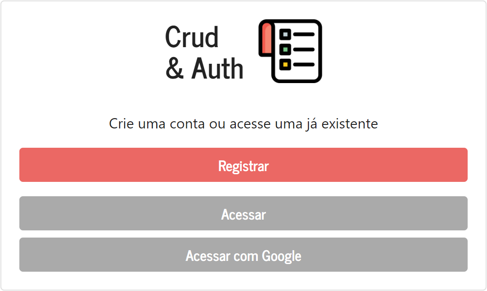
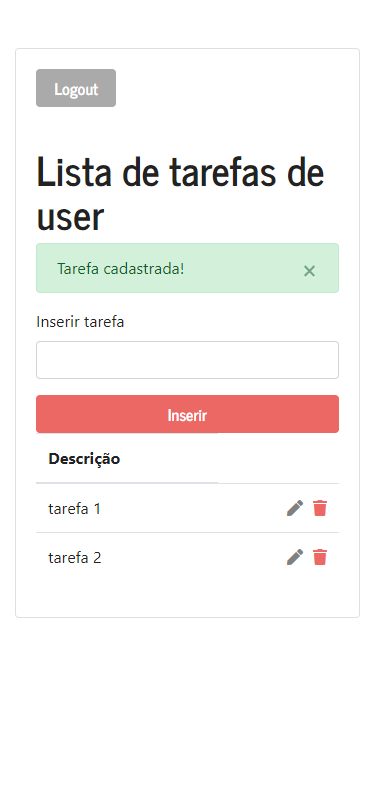
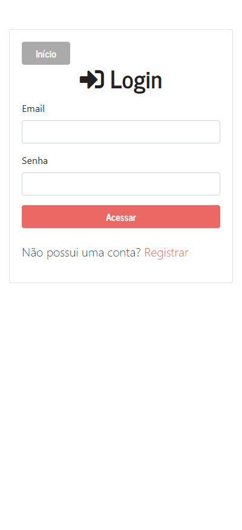
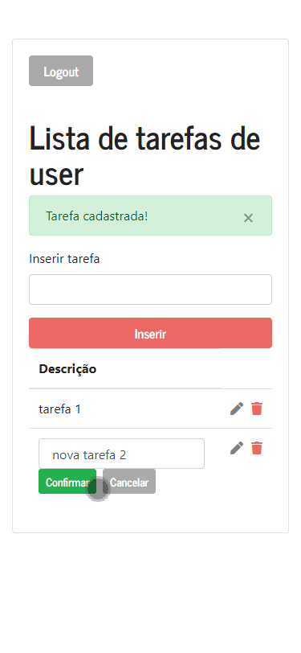
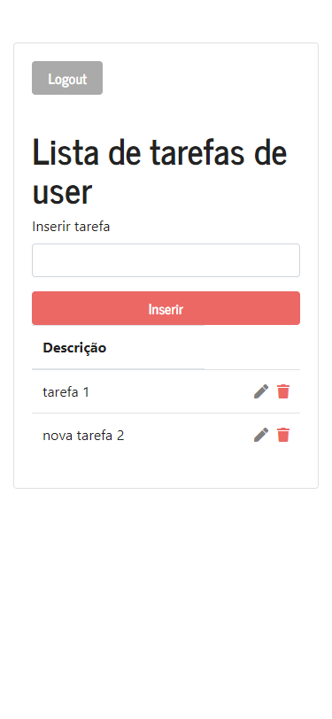

# Crud & Auth APIs (microservices)

#### Descrição
O projeto consiste de dois microserviços: autenticação e CRUD. Todos os endpoints do CRUD requerem autenticação, que pode ser feita por usuário/senha ou utilizando o serviço de OAuth do Google. Foi utilizado PassportJS para lidar com a parte de autenticação.

As atividades funcionalidades totalmente implementadas estão marcadas no template com um [x]

# Screenshot da aplicação

<h3 align="center">Tela inicial</h3>
<p align="center">
  
</p>
<h3 align="center">Dispositivo móvel</h3>
<p align="center">
  
</p>
<h3 align="center">Login/Editar tarefa/Remover tarefa</h3>
<p align="center">
  
  
  
</p>

# Instruções para rodar em dev/produção

### Dev: 

1. Clone esse repositório para a sua base local
2. Instale as dependências necessárias: 
```
node install
```
3. Altere as chaves de autenticação e a url de callback do Google OAuth presentes em ./configo/keys.js
``` 
module.exports = {
    MONGO_URI: '<Your Mongo URI>',
    google: {
        CLIENT_ID: '<Your Google API client Id>',
        CLIENT_SECRET: '<Your Google API client secret>',
        CALLBACK_URL: 'https://<Your URL>/usuarios/login/google/redirecionar'
    }
}
```
4. Rode a aplicação em modo de desenvolvimento
```
npm run dev
```

### Produção: 

1. Clone esse repositório para a sua base local
2. Instale as dependências necessárias: 
```
node install
```
3. Altere as chaves de autenticação e a url de callback do Google OAuth presentes em ./configo/keys.js
``` 
module.exports = {
    MONGO_URI: '<Mongo production URI>',
    google: {
        CLIENT_ID: '<Production Google API client Id>',
        CLIENT_SECRET: '<Production Google API client secret>',
        CALLBACK_URL: 'https://<Production URL>/usuarios/login/google/redirecionar'
    }
}
```
4. Caso esteja usando Git para versionar o código, efetue o commit da alteração
```
git commit -am "Configuração de produção"
```
6. Adicione o repositório de produção
```
git remote add <nome do repositorio de produção> <endereço do repositório de produção>
```
5. Efetue o push para o repositório de produção
```
git push
```

# Atividade proposta
##### Criar:
1.  Microserviço de autenticação (AUTHENTICATION)
2.  Microserviço que use precise usar a autenticação (MOCK).

# Requisitos Funcionais

- [x] O microserviço AUTHENTICATION deve ter a opção de 2-factor authentication por pelo menos 2 canais (Ex: e-mail, sms, aplicativo)

- [x] O microserviço MOCK deve ter implementado um CRUD (de qualquer coisa)

- [x] Todos os endpoints do MOCK devem ser autenticados

# Requisitos não-funcionais

- [x] Deve estar no padrão REST

- [x] Deve estar rodando em pelo menos 2 ambientes (Local Development e Production)

- [x] Deve ter a documentação de como rodar localmente e de como rodar os ambientes em production

- [ ] Todos os serviços devem funcionar com Docker

- [x] Deve estar na mesma codebase

- [x] Deve funcionar dentro da AWS

- [x] Deve ter testes unitários

- [x] Deve ter CI/CD

- [ ] Desejável ter a documentação da API em SWAGGER
